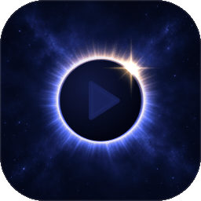

# Luna IPTV



Linux için özgün, kişisel IPTV istemcisi. Python, Qt 6 ve libmpv kullanır. GNOME Wayland üzerinde Qt'nin OpenGL yüzeyine doğrudan video çizer; XWayland zorunlu değildir.

## openSUSE kurulumu

```bash
sudo zypper install ./dist/luna-iptv-0.17.0-1.noarch.rpm
luna-iptv
```

Dosya adı farklıysa `dist/` içindeki RPM adını kullanın. Paket bağımlılıkları: Python >=3.11, python3-pyside6 >=6.8, python3-python-mpv >=1.0.8 libmpv2 ve python3-dbus-python. PySide6 ve python-mpv üst sınırları pyproject/spec içinde sabittir. RPM yerel geliştirme çıktısıdır, dağıtım deposu imzası içermez. openSUSE Tumbleweed üzerinde üretilir; Leap uyumluluğu ayrıca doğrulanmamıştır. Kurulum yönetici yetkisi gerektirir; geliştirme sırasında sistem paketleri değiştirilmez.

## Kullanım

“Kaynak ekle” ile yerel/uzak M3U, Xtream hesabı veya tek yayın/video dosyası açın. Solda kaynak, içerik türü ve kategori seçin; arayın ve bir yayına tıklayın. Canlı kanallar doğrudan açılır; film ve diziler önce ayrıntı kartını gösterir. Yıldız favoriye ekler. Kaynak menüsünden seçili kaynağı yeniden adlandırabilir, bağlantısını düzenleyebilir, yenileyebilir, kontrol edebilir veya kaldırabilirsiniz. XMLTV adresini M3U ile birlikte ya da “Rehber ekle” üzerinden bağlayın; kanal eşleştirmesi `tvg-id` ile yapılır. M3U'daki `url-tvg` ve `x-tvg-url` rehberleri otomatik algılanır.

Film/dizi kartında afiş, açıklama ve sağlayıcının verdiği yıl, tür, süre, yönetmen, oyuncular ve puan görünür. Kaynağı bilinmeyen puan **IMDb** diye etiketlenmez; geçerli `tt…` kimliği varsa **IMDb'de aç** bağlantısı gösterilir. Bu bağlantı puanın kaynağını doğrulamaz. Xtream dizilerinde kartın **Sezon / Bölüm** alanlarından seçim yapıp **Oynat** düğmesine basın. Başlık, açıklama, puan, IMDb bağlantısı ve **Bölümü favorilere ekle/çıkar** düğmesi seçilen bölüme aittir; eksik bölüm bilgisi dizi bilgisiyle doldurulmaz. **Dizi bilgileri** alanı genel açıklamayı, metadata ve ayrı **Diziyi favorilere ekle/çıkar** işlemini gösterir. Bölüm afişi yoksa kullanılan dizi afişi açıkça etiketlenir. Kayıtlı ilerleme varsa mevcut **Devam et / Baştan başlat / Vazgeç** seçimi Oynat sonrasında açılır. Kartı açmak, favoriye eklemek veya kapatmak açık yayını değiştirmez. M3U/doğrudan dosya için sağlayıcı ayrıntıları sorgulanmaz; eksik açıklama ve afiş açıkça belirtilir, film yine oynatılabilir.

Kartın **Ses dili** ve **Altyazı dili** alanları, örneğin İngilizce ses + Türkçe altyazı gibi oynatma tercihlerini hazırlar. Ses için **Otomatik**, altyazı için **Otomatik / Kapalı** vardır. Bunlar içerikte bulunduğu doğrulanmış dillerin listesi değildir; gerçek parçalar normal yayın yüklemesinden öğrenilir, keşif için ikinci bağlantı açılmaz. Kartı değiştirmek/kapatmak veya devam sorusunu iptal etmek açık yayını ve kayıtlı tercihleri değiştirmez.

**Bu kaynak için hatırla** işaretliyse seçim ancak Oynat ve varsa devam/baştan başlat kararı onaylandığında kaynak bazında kaydedilir. İşaretli değilse seçilen diller yine bu oynatmada, aynı içeriğin yeniden başlatılmasında ve yeniden denemesinde kullanılır; önceki kayıtlı diller silinmez, kaynak için hatırlama kapalı kalır. Aynı kartta bölüm değiştirmek hazırlanan dil tercihlerini korur.

Dil tercihleri mpv'nin dosyaya özel `loadfile` seçeneklerine eklenir; ilk parça seçimi oynatma başlamadan yapılır. Tercih edilen ses yoksa varsayılan ses kullanılır; tercih edilen altyazı yoksa başka dilde altyazıya düşülmez, kapalı kalır. Kısa bilgi oynatıcı başlığında gösterilir. **Otomatik**, sağlayıcı/mpv varsayılan seçimini kullanır. Oynatma sırasındaki gerçek parça menüsü mevcut `TrackPreferences` altyapısıyla çalışmayı sürdürür. [mpv parça seçimi seçenekleri](https://mpv.io/manual/stable/#track-selection).

Oynatıcı pause, ses/mute, desteklenen akışlarda seek, ses/altyazı seçimi, tam ekran ve mini oynatıcı içerir. **Oynatma** menüsünden **Bu kaynak için tercihleri hatırla** seçeneğini açıp kapatabilir veya ses/altyazı tercihlerini sıfırlayabilirsiniz. Anlamlı bir ara konumu kayıtlı olan film/bölüm seçildiğinde oynatma değişmeden önce **Devam et / Baştan başlat / Vazgeç** sorulur; ilk birkaç saniyedeki veya bitişe yakın kayıtlar doğrudan başlar, canlı yayınlar soru göstermez. Son izlenenler yerel geçmişten gelir. Geçmiş temizlenirken devam konumlarını sıfırlamak isteğe bağlıdır; kaynaklar ve favoriler korunur. O sırada açık olan yayın veya otomatik yeniden bağlanma geçmişi hemen geri eklemez; yeni bir kullanıcı oynatma seçimi kaydı yeniden başlatır. Canlı yayınlarda seek, akışın sağladığı pencereye bağlıdır.

### 0.17.0 · ana sayfa ve izleme kolaylıkları

- **Ana sayfa** (menünün başında, açılışta gelir): saate göre selam ve profil adı; "Kaldığın yerden devam et" (yarım kalan film ve bölümler, altın ilerleme çizgisiyle), "Favorilerinde şu an" (favori kanallarda o an yayındaki program), "Son izlenen kanallar" ve "Favori filmler ve diziler" şeritleri. Boş şeritler görünmez; çocuk profilinde kilitli içerik yer almaz.
- **Uyku zamanlayıcısı** (oynatıcıdaki ay düğmesi): 15–120 dakika ya da "bu program / film / bölüm bitince"; uzatılabilir, kalan süre düğmenin yanında.
- **Sonraki bölüm:** bölüm bitince 10 saniyelik geri sayımla sonraki bölüm başlar ("Şimdi oynat" / "İptal"). Ayarlar'dan kapatılırsa yalnız önerilir.
- **Kanal numarası:** klavyeden rakam yazınca seçili kaynağın canlı listesindeki o sıradaki kanal açılır ("12 · Kanal adı").

### 0.16.0 · profiller ve ebeveyn denetimi

- **Profiller:** kenar çubuğundaki yuvarlak simgeden profil değiştirilir. Her profilin kendi favorileri, klasörleri, izleme geçmişi ve hatırlatıcıları vardır; kaynaklar ve ayarlar ortaktır. Birden fazla profil varsa Luna açılırken "Kim izliyor?" diye sorar. Var olan veriler ilk profile ("Ben") kayıpsız taşınır.
- **Ebeveyn denetimi** (profil menüsünde): bir PIN belirlenir; yetişkin kategorileri kendiliğinden bulunup kilitlenir, liste üzerinden kategori seçilir, kartın sağ tık menüsünden tek yayın kilitlenir. Kilitli içerik her açılışta PIN ister (hatırlanmaz), kartında afiş ve program gösterilmez, kanal değiştirirken atlanır. Ayarlar, kaynak ekleme/düzenleme/silme, yedekler, profiller ve denetimin kendisi de PIN ister. Beş yanlış denemede 30 saniye beklenir.
- **Çocuk profili:** kilitli kategoriler ve yayınlar listede, aramada, geçmişte ve rehberde hiç görünmez; çocuk profilinden çıkmak PIN ister. Bir profile "girerken PIN sor" da denebilir.
- PIN PBKDF2 ile özetlenip saklanır, yedeğe girmez. PIN bir erişim denetimidir, verileri şifrelemez.
- **Kategori düğmeleri** artık sıkışmıyor; sığmayanlar "Tüm kategoriler" listesinde bekler.

### 0.15.0 · rehber, hatırlatıcı, yedekleme

- **Rehber** (menüde Canlı TV'nin altında): kanallar solda geniş logolarıyla, saatler üstte; altın "şu an" çizgisi, yayındaki programda ilerleme. Dün'den altı gün sonrasına gün düğmeleri, "Şimdi", program arama (eşleşen kanallar kalır, programlar altınla çerçevelenir). Programa tıklayınca kart: "Kanalı aç" ve gelecek programlar için "Hatırlat". Yalnız ekrandaki satır ve saatler çizilir; binlerce kanalda da akıcıdır.
- **Hatırlatıcı:** program başlamadan 5 dakika önce masaüstü bildirimi ve "İzle" düğmesi. Rehberden, kanal kartının sağ tık menüsünden kurulur; Kaynak menüsünde "Hatırlatıcılar…" listesi. Luna kapalıyken kaçırılanlar sonradan gösterilmez; bildirim sunucusu yoksa durum satırına yazılır.
- **Yedekleme:** Kaynak menüsünde "Yedekle…" / "Yedekten geri yükle…". Kaynaklar, favoriler, klasörler, oynatma tercihleri, ayarlar ve isteğe bağlı izleme geçmişi tek JSON dosyasında. Hesap bilgileri ve erişim bilgisi taşıyabilecek adresler yalnız açıkça seçilirse yazılır (düz metin uyarısıyla); seçilmezse o kaynakların bağlantısı geri yüklemeden sonra "Bağlantıyı düzenle" ile tamamlanır. Geri yükleme önce dosyayı doğrular, özet gösterir ve tek veritabanı işleminde birleştirir; yedekte olmayan veriye dokunmaz.

### 0.14.0 · gezinme ve düzen

- **Kategori düğmeleri:** "Tümü", en kalabalık yedi kategori ve geri kalanlar için arama kutulu "Tüm kategoriler" listesi.
- **Tek arama:** Canlı TV, Filmler ve Diziler'de yazınca hepsinde aranır (bölümler diziler üzerinden); "Canlı / Film / Dizi" düğmeleri sonuç sayısıyla daraltır. Favoriler ve Geçmiş'te arama kendi listesinde ve sırasında kalır.
- **Dizi bölüm listesi:** sezon sekmeleri; her bölümde numara, süre, yarım kalanlarda altın çizgi, bitenlerde "İzlendi". Çift tıklama oynatır, Enter yalnız seçer.
- **Favori klasörleri:** Favoriler'de klasör düğmeleri, "+ Yeni klasör", klasöre sağ tıkla yeniden adlandır/sil. Herhangi bir karta sağ tıklayınca favori ve klasör üyeliği. Klasörler favorilerin alt kümesidir; favoriden çıkan kanal tüm klasörlerden de çıkar.
- **Ayarlar** (menüde dişli): hareket Tam/Az/Kapalı (anında uygulanır), varsayılan ses ve altyazı dili (kaynağın kendi kaydı önceliklidir), açılışta son kanalı seç/oynat/hiçbir şey.
- Bölüm listesi, ayarlar ve favori klasörleri Codex'e ayrı git kopyalarında paralel yazdırıldı; inceleme, birleştirme ve testler burada yapıldı.

### 0.13.1 · inceleme düzeltmeleri

- Sarma bittiğinde (klavyeden ya da medya kontrolünden) GNOME'a yeni konum bildirilir; durunca konum sıfırlanır.
- Geçmiş konumları sıfırlanarak temizlenince altın ilerleme çizgileri hemen kaybolur.
- Son canlı kanal, ardından kaç film izlenmiş olursa olsun açılışta bulunur.

### 0.13.0 · günlük kolaylıklar

- **Page Up / Page Down:** canlı yayın izlerken ızgaradaki sıraya göre önceki/sonraki canlı kanala geçer (başa/sona sarar). Canlı yayın yokken ızgarayı sayfa sayfa kaydırır.
- **İzleme ilerlemesi:** yarım kalan film ve bölümlerin afişinde altın çizgi. Konumlar açılışta tek sorguyla okunur, oynatırken güncellenir.
- **Son kanal:** açılışta son izlenen canlı kanal seçili ve görünür gelir; Enter ile oynar. Kendiliğinden oynatılmaz.
- **Medya tuşları ve GNOME medya kontrolü (MPRIS):** oynat/duraklat, durdur, sonraki/önceki kanal, sarma ve pencereyi öne getirme. GNOME'da kanal adı, o anki program ve logo görünür. Ek bağımlılık yoktur (Qt D-Bus).
- Geliştirme: `scripts/test-quiet.sh` ekran gerektirmeyen tüm testleri Qt offscreen platformunda en düşük öncelikle çalıştırır; hiçbir pencere açılmaz.

### 0.12.2 · inceleme düzeltmeleri

- Oynatma listesi kimliği bildirmeyen oynatıcı yolunda da pause, ekran uyku engelini bırakır.
- Izgara kaydırılırken detay kartının bekleyen afiş isteği kuyruktan düşmez.
- Genişlik sütunlara tam bölündüğünde son sütunun alt satıra kayması düzeltildi.

### 0.12.1 · küçük düzeltmeler

- Fare menü logosunun üzerindeyken video başlasa da logo hareket etmez.
- Favoriler ve Geçmiş'teki geniş kartlarda afişler esnetilmez, ortadan kırpılır.

### 0.12.0 · tutulma logosu

- Yeni logo: ay güneşi örterken taşan ışık halkası ve kenarında "elmas yüzük" parıltısı. Masaüstü ikonu 16–512 px PNG boyutlarında kurulur.
- Logo uygulamada hareket eder: sol menüdeki logo fareyle üzerine gelince, karşılama ekranındaki büyük logo ekran görünürken. Işık halkası yavaşça salınır, parıltı nabız atar. Video oynarken hiçbiri çalışmaz.
- Görseller katmanlıdır (`assets/logo`): gece zemini, siyah üzerinde ışık halkası ve siyah üzerinde parıltı. Parlak katmanlar "toplama" kipinde eklenir; disk ve oynat işareti vektör çizilir. `scripts/build-logo.py KATMAN_KLASÖRÜ` yerleşimi ölçer, ikonları ve `docs/luna-logo.gif` animasyonunu üretir.

### 0.11.0 · IMDb'de bul

- Sağlayıcı IMDb kimliği vermediğinde film kartında **IMDb'de bul**, dizi bilgilerinde **Diziyi IMDb'de bul** görünür. Basıldığında temizlenmiş ad ve yıl IMDb'nin başlık önerisi servisine sorulur; ad, tür ve yıl tek bir kayıtla kesin eşleşirse o sayfa, aksi hâlde IMDb arama sayfası açılır. Türkçe çeviri adlar genellikle arama sayfasına düşer. Servis belgelenmemiştir; hata, zaman aşımı veya beklenmeyen yanıtta arama sayfası açılır. Sorgu yalnız düğmeye basınca gönderilir.
- Geçersiz IMDb kimlikleri yine asla açılmaz; bölüm kartı dizinin bağlantısını ödünç almaz.
- Tam ekranda video, ekran oranı 16:9 olmasa da ekranın tamamını doldurur.

### 0.10.0 · afiş kartları ve yeni detay kartı

- Filmler ve Diziler bölümünde içerikler 2:3 afiş kartları olarak dizilir; afişler kart çözünürlüğünde (240×360) hazırlanır ve detay kartıyla aynı önbelleği paylaşır. Afiş oranı korunur, gerekirse kırpılır, asla esnetilmez.
- Detay kartı: afişin bulanık hâli arka planda, solda yuvarlak köşeli afiş, büyük başlık, "yıl · tür · süre · ★ puan" satırı ve açıklama. Künye, dizi bilgileri ve oynatma tercihleri ayrı panellerde. **Oynat** ve **Favorilere ekle** kartın altındaki sabit çubukta, kart küçültülse de görünür kalır.
- Izgara, pencere veya paneller yeniden boyutlandığında sütun sayısını hemen günceller.

### 0.9.0 · Logo Duvarı

- Kanallar geniş logolu kartlar olarak ızgarada görünür; sütun sayısı pencere genişliğine uyar. Logosu olmayan kanalda adı logo yerine yazılır.
- XMLTV rehberi bağlıysa kart, o an yayındaki programı, saatini ve ilerlemesini gösterir; ilerleme yarım dakikada bir tazelenir. Kanal başına sıralı rehber dizini sayesinde çizim sırasında tüm rehber taranmaz.
- Solda ince ikon menüsü; kaynak ve kategori seçimi kütüphane başlığında. Oynatıcı sağ panelde 16:9 oranında; altında şimdi ve sıradaki dört program.
- Oynatma sırasında pencere kapatılırken ara sıra oluşan çökme düzeltildi (python-mpv'nin güncelleme geri çağrısını libmpv onu kullanırken serbest bırakması).

### 0.8.0 · Gece Ayı arayüzü

- Yeni görünüm: gece mavisi zemin, ay ışığı vurgu rengi ve favoriler için sıcak altın. Kenar çubuğu, kanal listesi, oynatıcı, rehber ve pencereler aynı tasarım dilini kullanır.
- Luna'ya özel çizgi ikonlar (canlı TV, film, dizi, favori, oynatıcı düğmeleri). İkonlar vektördür, her ekran ölçeğinde keskin kalır.
- Hafif hareket: düğmeler üzerine gelince yumuşakça aydınlanır, seçili bölüm göstergesi menüde kayar, karşılama ekranında yıldızlar parıldar ve ay nefes alır. Animasyonlar yalnız etkileşimde ve karşılama ekranı görünürken çalışır; video oynarken hiçbir animasyon zamanlayıcısı çalışmaz.
- Yazı tipi: Poppins kuruluysa arayüzde o, değilse Adwaita Sans/Cantarell kullanılır. Logo, küçük başlıklar ve süre göstergesi Hurmit daktilo karakterini korur.
- Yeni dosya oynamaya başladığında oynat düğmesi hemen "duraklat" simgesine geçer.

### 0.7.0 · oynatırken ekran uyanık

- Yayın oynarken GNOME ekranı karartmaz ve bilgisayar boşta uyku moduna geçmez. GNOME oturum yöneticisi yoksa freedesktop ekran koruyucu arayüzü kullanılır.
- Pause, durdurma, yayının bitmesi veya hata, kaynak yenilenince kalkan kanal ve pencereyi kapatma engeli hemen bırakır. Uygulama çökerse masaüstü engeli kendiliğinden kaldırır.
- D-Bus yoksa oynatma etkilenmez; yalnız uyku engeli çalışmaz.

### 0.6.0 · oynatma öncesi dil tercihleri

- Detay kartında bağımsız ses/altyazı dili, Otomatik/Kapalı ve kaynak bazında hatırlama.
- Onaylanan yeni yayına dosyaya özel dil seçenekleri; kart/iptal sırasında açık yayına müdahale yok.
- İlk parça seçimi, eksik dil geri dönüşleri, bölüm ve devam/yeniden başlatma için native regresyonlar.

### 0.5.0 · film ve dizi ayrıntıları

- Film/dizi kartları, arka plan metadata sorgusu ve kalıcı önbellek; ayrı bölüm/dizi bilgileri, sezon/bölüm seçimi ve açık oynatma/favori hedefleri.
- `auth: 0`, sağlayıcı hataları ve başarısız yanıtlar boş başarı sayılmaz; eski metadata korunur ve **Yeniden dene** sunulur. Geçerli ama eksik metadata gösterilebilir.
- Eski deneme sürümünün bölüm ve dizi bilgilerini birleştiren önbellek kayıtları yeniden alınır; hesaplar, kaynaklar, favoriler, geçmiş ve izleme konumları silinmez.

### 0.4.0 · bağlantılar ve günlük kullanım

- **Bağlantıyı düzenle**, mevcut M3U adresini, Xtream sunucu/kullanıcı/şifresini veya doğrudan yayın adresini aday katalog doğrulandıktan sonra tek işlemde günceller. Hatalı, iptal edilmiş veya geç kalan sonuç eski bağlantıyı ve kataloğu değiştirmez. Oynayan yayın kesilmez; sonraki açılış güncel adresi kullanır.
- Xtream'de sağlayıcının kararlı yayın kimliği bulunan girdilerin, doğrudan kaynakta ise tek kaydın favori ve ilerleme kimliği korunur. Serbest M3U satırları için sağlayıcı kimliği garantisi yoktur; eşleşmeyen veya kaldırılan yayınlar korunmuş sayılmaz.
- **Bağlantıyı kontrol et**, video açmadan ve tam kataloğu indirmeden ulaşılabilirlik durumunu ve son kontrol zamanını kaydeder. Doğrudan HTTP yayınında sunucunun HEAD isteğine yanıt vermesi yalnız sunucunun yanıt verdiğini gösterir; akışın oynatılabildiğini kanıtlamaz.
- Canlı yayın kesildiğinde ilk açılışa ek olarak **1 / 2 / 4 saniye** beklemeli en fazla üç otomatik yeniden deneme yapılır. Bağlanma, arabelleğe alma, bekleme ve başarısızlık durumu görünür; bekleme iptal edilebilir. Kullanıcı pause'u ve film/bölüm sonu yeniden bağlanma başlatmaz. Film/bölüm için elle **Yeniden dene**, kayıtlı devam konumunu korur.
- Ses ve altyazı seçimi değişebilen parça numarası yerine dil/başlık gibi anlamlı bilgiyle kaynak bazında hatırlanır. **Kapalı**, hatırlamayı kapatma ve sağlayıcı varsayılanına dönmek için tercihleri sıfırlama seçenekleri kalıcıdır; bulunmayan tercih oynatmayı engellemez.
- **Mini**, aynı native pencereyi, video yüzeyini ve oynatıcıyı kompakt düzene geçirir; oynat/pause, ±5 saniye, mute/ses ve bağlantı durumu erişilebilir kalır. **Geri dön** veya **Esc** normal geometriyi ve görünürlüğü geri getirir; mini/tam ekran geçişleri ikinci bir video bağlamı oluşturmaz. GNOME Wayland'de her zaman üstte kalma garantisi verilmez.

### 0.3.0 · sarma ve tam ekran

- **−5 sn / +5 sn** düğmeleri ve sol/sağ oklar, sarılabilen yayında beş saniye atlar.
- **≪ / ≫** düğmeleri aynı yönde her tıklamada **2× → 4× → 8× → 16× → normal** tarama seçer. Karşı yön düğmesi o yönde 2× başlatır. Film/bölüm içinde yer ararken görüntüler atlayarak ilerler; gösterilen değer hedef tarama hızıdır, kesintisiz hızlı oynatma değildir. Ağın ve videonun yapısına göre karelerin geliş süresi değişebilir.
- **Oynat**, hız göstergesi veya **K**, taramadan çıkarak 1× oynatır. Beş saniye atlama ve konum çubuğu da taramayı bitirir; bunlar tarama öncesindeki duraklatma durumunu korur. Yeni yayın, durdurma, bitiş ve hata taramayı sıfırlar. Canlı yayınlarda, yalnız kısmen sarılabilen kaynaklarda ve süresi bilinmeyen videolarda sürekli tarama kapalıdır.
- **Tam ekran**, başlık/kenar boşluğu bırakmadan video alanını ekran boyutuna getirir. Kontroller video üzerinde görünür; fare hareketi veya klavye kullanımıyla açılır, 2,5 saniye boşta kalınca imleçle birlikte gizlenir. Kontrol üzerinde fare, klavye odağı, açık menü veya sürüklenen slider varken gizlenmez. **F / Esc** eski pencere düzenini geri getirir. Videonun en-boy oranı korunur.

Native Wayland yüzeyi ve donanım çözümleme korunur. Geri tarama, mpv'nin bellek tüketebilen ters decode modu yerine sınırlandırılmış zaman çizgisi atlamalarını kullanır. [mpv sarma komutları](https://mpv.io/manual/stable/#command-interface-seek).

### 0.2.1 · görüntü düzeltmesi

Altyazı gösterildikten sonra pencere değiştirirken veya video alanı yeniden çizilirken oluşabilen yatay bozulma/siyah görüntü düzeltildi. Qt ile mpv arasındaki OpenGL karıştırma durumu her karede doğru hazırlanır; native Wayland, donanım hızlandırma ve mevcut oynatıcı korunur. Teşhis ve test ayrıntıları `docs/render-state-fix.md` içindedir.

### 0.2.0 · günlük kullanım

- Kaynak menüsünden görünen adı sonradan değiştirebilirsiniz. Hesap bilgileri, favoriler ve oynayan yayın korunur.
- Son izlenenler en yeni izlenenden eskiye sıralanır; arama, kategori ve kaynak filtreleri bu sırayı korur. Türkçe/aksan duyarsız arama, kanal başına hazırlanan anahtarlarla büyük kataloglarda daha az iş yapar.
- M3U `tvg-logo` ve Xtream `stream_icon`/`cover` alanlarından kanal logoları görünür. Yalnız ekrandaki satırlar yüklenir; eksik veya bozuk görsellerde baş harfler gösterilir.
- Oynatıcının **Bilgi** düğmesi gerçek decoder boyutlarını, kaliteyi, seçili video/ses codec'lerini, FPS ve ses kanal düzenini gösterir. MPV bildirirse bitrate ve kaynak HDR/SDR bilgisi de görünür; bilinmeyen değerler uydurulmaz. HDR etiketi ekranın HDR çıkışını doğrulamaz. Bağlanma/arabellek beklemesi sade bir durum etiketiyle belirtilir.
- Seçili Xtream kaynağında **Hesap durumu**, hesap açılışı, bitiş/kalan süre, sağlayıcı durumu ve son kontroldeki aktif/izin verilen bağlantı sayısını gösterir. Kayıtlı bilgi hemen açılır; yenileme katalog indirmeden arka planda yapılır. Eksik tarih veya sıfır limit “sınırsız” sayılmaz. Hata durumunda son başarılı kontrol zamanı ve bilgi korunur.

Logo önbelleği veritabanının yanındaki `<veritabanı-adı>.logos/` klasöründedir; içerik URL yerine hash ile adlandırılır. En fazla dört eşzamanlı iş, 5 saniye ağ sınırı, 2 MiB indirme/4 milyon piksel decode sınırı, 256 bellek girdisi ve 64 MiB disk kotası kullanılır. Başarılı görseller 7 gün, başarısız istekler 15 dakika hatırlanır. Bu klasör uygulama kapalıyken silinerek temizlenebilir; kişisel kütüphaneye dokunulmaz. Logo URL'leri kendi sunucularından istenir; yayın HTTP kimlik başlıkları logo sunucularına aktarılmaz.

Film/dizi ayrıntıları yalnız kart açılınca Xtream'den arka planda alınır; SQLite içinde içerik ve kaynak bağlantısına bağlı olarak **24 saat** saklanır. Süresi dolmuş kayıt hemen gösterilip yenilenir; ağ hatasında son bilgiler ve kayıtlı bölümler korunur. Başarısız istekler oturum içinde **60 saniye** bekletilir; **Yeniden dene** ile beklemeden tekrar istenebilir. Aynı anda bir ayrıntı isteği çalışır; hızlı seçimlerde yalnız son bekleyen kart tutulur. Kaynak bağlantısı değişmiş, içerik silinmiş veya pencere kapanmışsa geç yanıt arayüze uygulanmaz. Afişler ayrı `<veritabanı-adı>.posters/` klasöründe 240 × 360 sınırında, mevcut logo indiricisinin aynı boyut/zaman/kota korumalarıyla saklanır; liste küçük resimleri değişmez. Ayrıntılar üçüncü taraf film servisine gönderilmez; yalnız IMDb düğmesine basmak tarayıcıyı açar.

| Kısayol | İşlem |
|---|---|
| Ctrl+O | Kaynak ekle |
| Ctrl+F | Ara |
| Boşluk | Oynat / duraklat |
| F | Tam ekrana gir / çık |
| Esc | Tam ekrandan veya mini oynatıcıdan çık |
| M | Sesi kapat / aç |
| Sol / sağ | Desteklenen akışlarda 5 saniye sar |
| J / L | Geri / ileri tara: 2×, 4×, 8×, 16× |
| K | Taramadan çık, 1× oynat |

Bir dosyayı pencereye bırakabilir veya `luna-iptv liste.m3u` / `luna-iptv video.mkv` çalıştırabilirsiniz. Arama yazarken tek harfli oynatıcı kısayolları devreye girmez.

## Yerel veri ve tasarım

Kütüphane `$XDG_DATA_HOME/luna-iptv` (varsayılan `~/.local/share/luna-iptv`) altında SQLite'tır. Dizin 0700, veritabanı 0600 izinlidir. Kaynak şifreleri ve şifre içerebilen yayın adresleri disk üzerinde ayrıca şifrelenmez. Uygulama bunları günlük mesajlarına yazmaz; telemetri, hesap sunucusu veya bulut senkronizasyonu yoktur. Ayrı test kütüphanesi için `--data-dir /tmp/luna-test` kullanın.

Luna tasarım sistemi: sıcak `#1d2021` yüzey, `#e889a8` vurgu, `#f8e7ec` metin; Hurmit Nerd Font Propo arayüz yazısı ve uygun yerlerde mono yazı ilkesi. Hurmit kurulu değilse sistem sans yazısına döner. Yazı tipi dağıtıma eklenmez. Renk/boşluk kuralları `luna_iptv/theme.py` içinde merkezidir. Özgün hilal/oynat simgesi uygulamaya aittir. Neon, glow ve sürekli animasyon yoktur.

## Kaynaktan çalıştırma

Sistemin geliştirme gereksinimleri:

```bash
sudo zypper install python3 python3-pip python3-pyside6 python3-python-mpv libmpv2
python3 -m venv --system-site-packages .venv
.venv/bin/pip install -e '.[dev]'
./scripts/run-dev.sh
```

`run-dev.sh`, bu geliştirme oturumunda indirilen `work/deps/root/usr/lib64` varsa onu yalnız bu süreç için kullanır. Sistem kurulumunda buna gerek yoktur. Qt, Wayland oturumunda native Wayland'ı seçer. Sorun teşhisinde `QT_QPA_PLATFORM=xcb` elle seçilebilir; uygulama bu seçimi zorlamaz.

## Test ve paket

```bash
./scripts/test.sh
./scripts/build-rpm.sh
```

Ek doğrulamalar: `scripts/balanced_probe.py` birleşik logo/hesap/medya arayüzünü, `scripts/benchmark-search.py` 10 bin–100 bin kanallık aramayı, `scripts/benchmark-zapping.py` yerel yayınlar arasında görünür kareye kadar geçiş süresini ölçer. Sonuçlar `work/qa/` altında kalır. Bu sentetik ölçümler internet sağlayıcısının gecikmesini ölçmez.

Medya testleri FFmpeg ile yerel sentetik görüntü/ses üretir; gerçek bir sağlayıcı yayını gibi sunulmaz. Parser/depolama/provider testleri ağ sağlayıcısına bağımlı değildir. Renderer ve GUI smoke testleri çalışan bir Wayland ya da X11 oturumu gerektirir. Kesin sonuç ve sınırlar `docs/verification.md` dosyasındadır. Native Wayland kanıtı: `env -u DISPLAY -u GDK_BACKEND QT_QPA_PLATFORM=wayland ./scripts/test.sh`.

## İnceleme ve sınırlar

Smarters yalnızca kamuya açık bilgi mimarisi/kullanım akışları açısından incelendi: canlı yayın, film/dizi kütüphanesi, listeler, favoriler ve rehber. Kod, görsel varlık, marka veya ekran tasarımı kopyalanmadı. Araştırma kaynakları `docs/research.md` içindedir.

Bu sürüm kayıt, çoklu ekran, catch-up/time-shift, DRM veya ebeveyn kilidi içermez. Gerçek sağlayıcı hesabı verilmediği için Xtream doğrulaması yerel HTTP fixture ile yapılır. Sağlayıcının codec/format/erişim sınırları yayına göre değişebilir; istemci içerik ya da abonelik sağlamaz.
